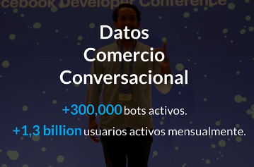

## Curso de Procesamiento de Lenguaje Natural - Platzi


**BOT vs Assitente virtual**

Un Bot está configurado para dar respuestas predeterminadas y un Asistente Virtual con modelo NLP tendrá varias funcionalidades basadas en AI(Inteligencia Artificial): entender voz, texto, automatizar tareas, enviar un correo y mucho más.



**PROYECTO**

NLP para el entrenamiento de Ted, asistente virtual de una aereolínea que automatice las reservaciones de vuelos internacionales y gestione las reservas en una base de datos ene tiempo real en la nube.

Requrimientos:

- Asistente virtual que comprenda voz y texto
- Reservaciones de vuelos internacionales
- Múltilingue
- Disponible 24/7

**REPO**

https://github.com/leoaiassistant/CloudAirlines_NLPlatzi

**Recursos extra**

https://dialogflow.cloud.google.com/cx/projects
https://wit.ai/ 
https://dashboard.chatfuel.com/
https://www.twilio.com/
https://developers.google.com/assistant 
https://about.fb.com/news/2018/05/f8-2018-new-tools-for-businesses-and-people-to-deepen-connections-in-messenger/
https://planetachatbot.com/c%C3%B3mo-crear-un-bot-para-fb-messenger-integrando-dialogflow-e47a35632472


**DIALOG FLOW**
Hay dos versiones, Dialogflow CX aún está en versión beta

Es una herramienta quee permite que las aplicaciones entiendan lenguage natural, clasifica intenciones y extrae entidades (palabras o frases claves)


Intents --> frases de entrenamiento 
        --> son las formas en las que el usuario puede activar a su asistente y sus respectivas respuestas.

Entities --> palabras , frases claves
         --> Las entidades son el mecanismo de Dialogflow para identificar y extraer datos útiles de las entradas de lenguaje natural

Fulfillment


## STEPS 

Importamos el archivo TEDCloudAirlines, subido en ZIP,  para hacer nuestro asistente multilingüe


## Lingüística computacional

- Clasificación de texto para que según la palabra se haga una acción 
- Árboles de decisión


## Reconocimiento de voz

## Automatizar procesos

Capturar parámetros y variables requeridos para generar una conversación útil

## Resticción en diáologos

## Integrar a fb messenger

El modelo de Procesamiento de Lenguaje Natural (NLP por sus siglas en inglés) de Dialogflow se integra con más de 15 plataformas de conversación populares como:

  -  **Facebook Messenger** (la utilizamos en este curso).

  -  **Google Assistant**: Crea acciones para el próximo billón de usuarios para dispositivos como Google Home, teléfonos inteligentes, parlantes inteligentes en la casa u oficina, relojes, autos, entre muchos otros dispositivos.

  -  **Slack**: Integra tu modelo de procesamiento de lenguaje natural para que equipos y empresas lo puedan usar en Slack.

  -  **Amazon Alexa**: Puedes exportar las habilidades de Alexa a un archivo en la consola de Dialogflow.

  -  **Microsoft Cortana**: La función de integración de Cortana te permite exportar sus agentes en un formato VCD compatible con Cortana y usarlo para crear aplicaciones.

  -  **Web**: La integración web facilita compartir tu agente a través de una página al insertarlo en tu sitio web.

  -  **Viber**: Dialogflow Viber Integration te permite crear fácilmente bots Viber con lenguaje natural.

  -  **Twilio**: Dialogflow Twilio Integration para SMS te permite comprender el Lenguaje natural con la tecnología Dialogflow.

  -  Phone Gateway (Beta): La función de puerta de enlace de telefonía proporciona una interfaz telefónica a tu agente. Para obtener una guía detallada, consulta pasos de acceso a la telefonía.

Otras: Telegram, Kik, Line, Cisco Spark.

## Respuestas dinámicas

**INLINE EDITOR**

Crear respuestas a través del fulfillment y no de respuestas predeterminadas, capturar parametros, enviar datos, sotrages them,  etc

On dialogflow enablee webhook for fulfilment, cuando todos los datos se guardaron


⚡ Fulfillment 

Esta sección nos da la posibilidad de habilitar el inline editor, donde podremos utilizar las Cloud Functions para Firebase

Crear una función para el intent que queramos
1. Inicializar la función

```js
intentMap.set('reserva.roundtrip', reserva);
```

2. Hacer la función 
```
function reserva(agente){
  	const name = agent.parameters.name;
    const email = agent.parameters.email;
    const idpassport = agent.parameters.idpassport;
    const paispassport = agent.parameters.paispassport;
    const origin = agent.parameters.origin;
    const fecha1 = agent.parameters.fecha1;
    const destination = agent.parameters.destination;
    const fecha2 = agent.parameters.fecha2;
  
    agent.add('Excelente la reserva fue creada con éxito');

  }
```


index.js

```js
// See https://github.com/dialogflow/dialogflow-fulfillment-nodejs
// for Dialogflow fulfillment library docs, samples, and to report issues
'use strict';
 
const functions = require('firebase-functions');
const {WebhookClient} = require('dialogflow-fulfillment');
const {Card, Suggestion} = require('dialogflow-fulfillment');
 
process.env.DEBUG = 'dialogflow:debug'; // enables lib debugging statements
 
exports.dialogflowFirebaseFulfillment = functions.https.onRequest((request, response) => {
  const agent = new WebhookClient({ request, response });
  console.log('Dialogflow Request headers: ' + JSON.stringify(request.headers));
  console.log('Dialogflow Request body: ' + JSON.stringify(request.body));
 
  function welcome(agent) {
    agent.add(`Welcome to my agent!`);
  }
 
  function fallback(agent) {
    agent.add(`I didn't understand`);
    agent.add(`I'm sorry, can you try again?`);
  }

  // // Uncomment and edit to make your own intent handler
  // // uncomment `intentMap.set('your intent name here', yourFunctionHandler);`
  // // below to get this function to be run when a Dialogflow intent is matched
  // function yourFunctionHandler(agent) {
  //   agent.add(`This message is from Dialogflow's Cloud Functions for Firebase editor!`);
  //   agent.add(new Card({
  //       title: `Title: this is a card title`,
  //       imageUrl: 'https://developers.google.com/actions/images/badges/XPM_BADGING_GoogleAssistant_VER.png',
  //       text: `This is the body text of a card.  You can even use line\n  breaks and emoji! 💁`,
  //       buttonText: 'This is a button',
  //       buttonUrl: 'https://assistant.google.com/'
  //     })
  //   );
  //   agent.add(new Suggestion(`Quick Reply`));
  //   agent.add(new Suggestion(`Suggestion`));
  //   agent.setContext({ name: 'weather', lifespan: 2, parameters: { city: 'Rome' }});
  // }

  // // Uncomment and edit to make your own Google Assistant intent handler
  // // uncomment `intentMap.set('your intent name here', googleAssistantHandler);`
  // // below to get this function to be run when a Dialogflow intent is matched
  // function googleAssistantHandler(agent) {
  //   let conv = agent.conv(); // Get Actions on Google library conv instance
  //   conv.ask('Hello from the Actions on Google client library!') // Use Actions on Google library
  //   agent.add(conv); // Add Actions on Google library responses to your agent's response
  // }
  // // See https://github.com/dialogflow/fulfillment-actions-library-nodejs
  // // for a complete Dialogflow fulfillment library Actions on Google client library v2 integration sample

  // Run the proper function handler based on the matched Dialogflow intent name
  let intentMap = new Map();
  intentMap.set('Default Welcome Intent', welcome);
  intentMap.set('Default Fallback Intent', fallback);


  // Initializing the funtion for roundtrip intent
  intentMap.set('reserva.roundtrip', reserva);


  // intentMap.set('your intent name here', yourFunctionHandler);
  // intentMap.set('your intent name here', googleAssistantHandler);
  agent.handleRequest(intentMap);
});

```


## Modelos de sugerencias

Inicializamos la función
```js
intentMap.set('reserva', tiporeserva);

```

Agregamos las sugerencias
```js
function tiporeserva(agent){
  agent.add('Qué tipo de vuelo desea reservar?');
  agent.add(new Suggestion ('Sólo ida'));
  agent.add(new Suggestion ('Ida y Vuelta'));
  agent.add(new Suggestion ('Multidestino'));
}
```

## URL

```js 
const videowelcome = 'https://www.youtube.com/watch?v=U9hq83ryFj0';
const welcome2 = 'https://encrypted-tbn0.gstatic.com/images?q=tbn:ANd9GcRCI7tShlyVeubGtVbh6XTCPNfZVlXFFYOEO55zskrSjLzwEKUQ';
```

```js
function welcome(agent) {
  agent.add(`Bienvenid@ te saluda Ted 🤖, la asistente virtual de Cloud Airliness`);
  agent.add(new Card({
      title: `NLP Demo `,
      imageUrl: welcome2,
      text: `Automatización de reservación de vuelos en una base datos en tiempo real en la nube.`,
      buttonText: 'Ver Video', 
      buttonUrl: videowelcome
    })
  );
  agent.add(`Recuerda que fui entrenada:`);
  agent.add(new Suggestion(`Reservar vuelos`));   
  agent.add(new Suggestion(`Códigos aeropuertos`));
}
```
